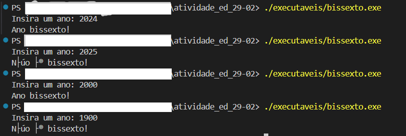
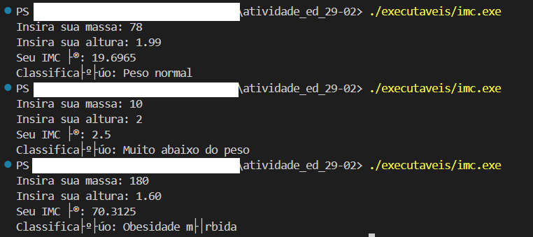

# Tarefa de Estrutura de Dados

Repositório para a entrega da atividade de Estrutura de Dados (29/02)

## Integrante

- Sillas Rocha da Costa

# Atividade

A descrição da atividade pode ser encontrada em [Atividade.pdf](./listaif.pdf), que se baseia em duas tarefas:

- Calcular o IMC a partir da massa e altura e retornar sua classificação.
- Identificar se um ano é ou não é bissexto.

# Modo de Uso

Para usar é possível tanto compilar e executar os arquivos `bissexto.cpp` e `imc.cpp` quando apenas executar os arquivos `bissexto.exe` e `imc.exe`, na pasta executaveis, de modo que quando executado ele receberá input do usuário, sendo que o imc recebe primeiro a massa e depois a altura, dois números floats e o bissexto recebe um número inteiro, o ano.

Para executar basta inserir o comando no terminal:

#### Bissexto
- `./executaveis/bissexto.exe`

#### IMC:
- `./executaveis/imc.exe`

## Exemplos de Uso

### Bissexto:

### IMC:

